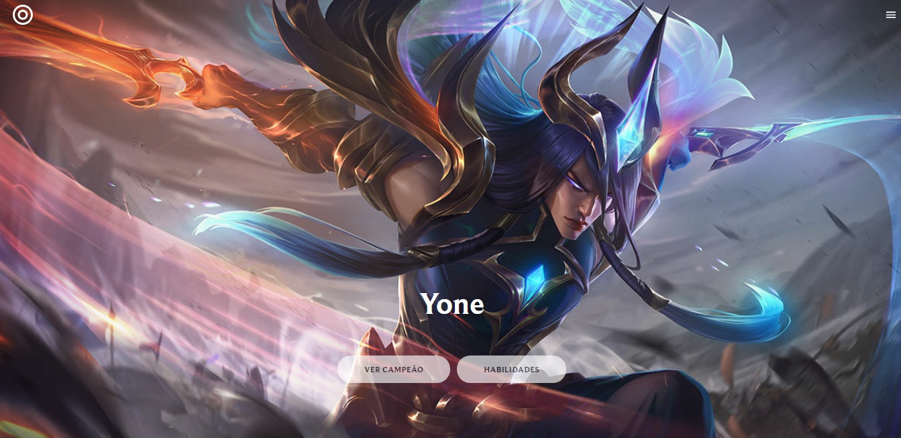
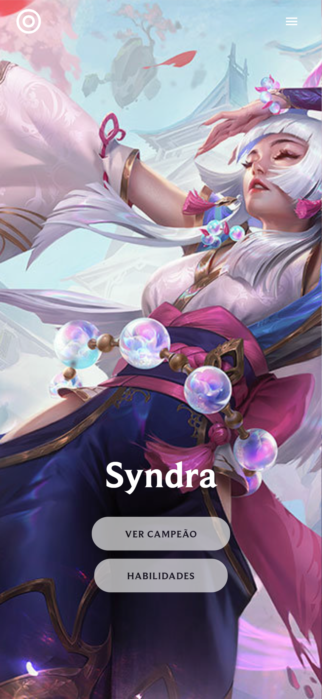

# UI Clone League of Legends Inspiration

Esse projeto foi criado utilizando o create-react-app.

## Scripts

No diretório do projeto, você pode iniciar com:

### `npm start`

Inicie o app no modo desenvolvimento
Abra [http://localhost:3000](http://localhost:3000) para visualizar em seu navegador.

## Saiba Mais

O projeto foi feito utilizando React, TypeScript, Styled-Components, e Framer Motion

Esse projeto serviu para aumentar ainda mais o conhecimento sobre o conceito de Mobile First, React Hooks, Context Hook, o próprio React e o TypeScript.
Nele foi feito a página principal da Tesla, efeitos de scroll e CSS.

A alteração para os campeões do LOL foi feita por mim, para que ficasse algo diferente de ser visto e mostrado. Porém ainda utiliza as animações da página exemplo.

## Imagem do Projeto Finalizado - Versão Computadores e Notebooks

## Imagem do Projeto Finalizado - Versão Mobile

